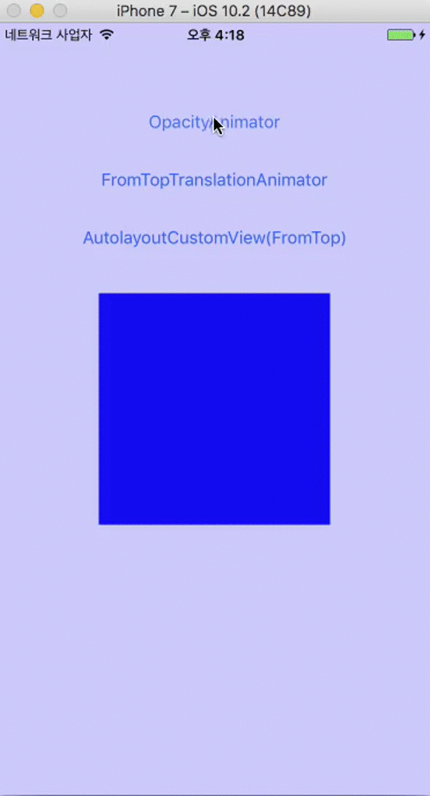

# KUIPopupController
- Simple Popup ContentView in iOS



## Requirements
- iOS 8.0+
- Swift 3.0

## Example
To run the example project, clone the repo, and run `pod install` from the Example directory first.

## Installation

#### CocoaPods
KUIPopupController is available through [CocoaPods](http://cocoapods.org). To install
it, simply add the following line to your Podfile:

```ruby
use_frameworks!
pod "KUIPopupController"
```

## Usage

#### KUIPopupContentViewProtocol

```swift
public protocol KUIPopupContentViewProtocol {
    var modalBackgroundColor: UIColor? { get } // default UIColor.black(alpha 0.6)
    var animator: KUIPopupContentViewAnimator? { get }
}

public extension KUIPopupContentViewProtocol where Self: UIView {
    public func show(_ parentViewController: UIViewController? = nil) 
    public func dismiss(_ animated: Bool) 
}
```

#### KUIPopupContentViewAnimator

```swift
public protocol KUIPopupContentViewAnimator {
    func animate(_ parameter: KUIPopupContentViewAnimatorStateParameter, completion: @escaping (Bool) -> Void)
}

```

KUIPopupContentViewAnimatorStateParameter:

| Property | Type | Description |
| ---|---|---|
| `isShow` | `Bool` | if the value is true, show state |
| `contentView` | `UIView ` | custom view |
| `containerView` | `UIView` | popup container view |
| `containerViewCenterX` | `NSLayoutConstraint` | container view centerX constraint |
| `containerViewCenterY` | `NSLayoutConstraint` | container view centerY constraint |


#### At a Glance


```swift
import KUIPopupController

class ContentView: UIView, KUIPopupContentViewProtocol {
    var animator: KUIPopupContentViewAnimator?
}

...

func showContentView {
  let view = ContentView()
  view.animator = KUIPopupContentViewAnimator
  view.show()
}
```

## Authors

Taeun Kim (kofktu), <kofktu@gmail.com>

## License

KUIPopupController is available under the ```MIT``` license. See the ```LICENSE``` file for more info.
